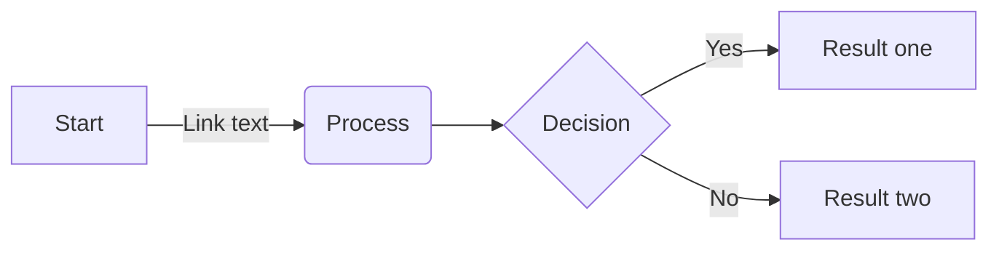
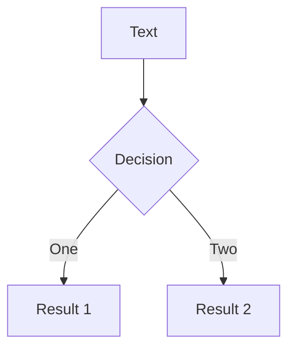
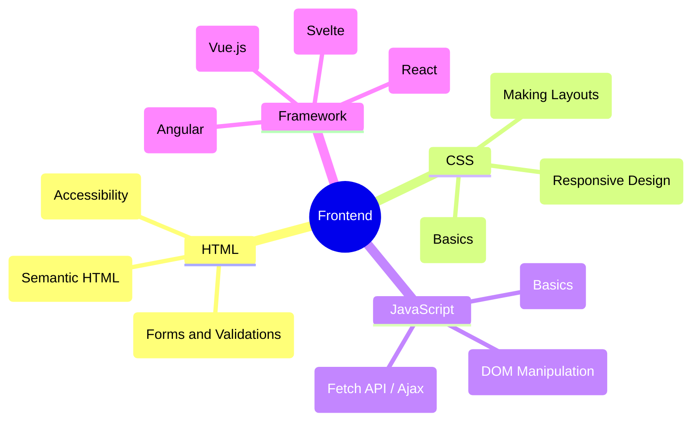

---
# You can also start simply with 'default'
theme: default
# random image from a curated Unsplash collection by Anthony
# like them? see https://unsplash.com/collections/94734566/slidev
# background: https://cover.sli.dev
# some information about your slides (markdown enabled)
title: Slidev
info: |
  ## Slidev Starter Template
  Presentation slides for developers.
# apply unocss classes to the current slide
class: text-center
# https://sli.dev/features/drawing
drawings:
  persist: true
# slide transition: https://sli.dev/guide/animations.html#slide-transitions
transition: slide-left
# enable MDC Syntax: https://sli.dev/features/mdc
mdc: true
---

# Welcome to Slidev !

專為開發者打造的簡報工具<br/>
( presentation by Laura )

<div class="abs-br m-6 text-xl">
  <a href="https://github.com/llaurrrraa/introduce_slidev" target="_blank" class="slidev-icon-btn">
    <carbon:logo-github />
  </a>
</div>

<style>

h1 {
  font-weight: bold;
  letter-spacing: 1.05px;
  font-size: 2.25rem !important;
  margin-bottom: 0.5rem;
}
.dark h1 {
  color: #fff !important;
}
.light h1 {
  color:rgb(0, 0, 0);
}

.slidev-layout h1 + p {
  opacity: 0.75;
}
.slidev-layout a.slidev-icon-btn:hover {
  color: #000;
}
.slidev-layout a:hover {
  padding: 0.5rem;
}
</style>

<!--
The last comment block of each slide will be treated as slide notes. It will be visible and editable in Presenter Mode along with the slide. [Read more in the docs](https://sli.dev/guide/syntax.html#notes)
-->

---
transition: fade-out
---

# What is Slidev?

▎　幫助開發者使用熟悉的技術，使簡報更有趣、提供極強的彈性和互動性。

- 📝 **基於 Markdown** - 先專心寫內容，也可以使用 Markdown 編排，樣式之後再調整就好！
- 🎨 **Themable** - 利用 npm 套件重複使用主題
- 👩‍💻 **Developer Friendly** - 提示程式碼、即時寫 code 
- 🎮 **Interactive** - 因為核心是 Vue, 任何 Vue 的套件都能使用
- 🎥 **Recording** - 支援錄影和內嵌講者鏡頭
- 📤 **Portable** - 支援匯出為 PDF、PPTX 和圖片格式，也能編譯成靜態網頁
- 🛠 **Hackable** - 作為一個基於網頁的簡報平台，因此能實現任何在網頁應用程式中的功能。例如，WebGL、API 請求、iframe 等。
<br>
<br>

Read more about [Why Slidev?](https://sli.dev/guide/why)

<!--
You can have `style` tag in markdown to override the style for the current page.
Learn more: https://sli.dev/features/slide-scope-style
-->

<style>
li {
  /* font-weight: bold; */
    font-size: 1.025rem;
  letter-spacing: 0.85px;
}
.light strong {
  color: #fff !important;
  padding: 0 0.5rem !important;
  letter-spacing: 0.5px;
  background-color: #000;
}
strong {
  color: #000 !important;
  padding: 0 0.5rem !important;
  letter-spacing: 0.5px;
  background-color: #fff;
}
</style>

<!--
Here is another comment.
-->

---
transition: slide-up
---

# 導覽列 Navigation

▎　在播放模式下，導覽列位於頁面左下角。


| Keyboard Shortcut      | Button in Navigation Bar            | Description   |
| ---------------------- | ----------------------------------- |---------------|
| <kbd>f</kbd>           | <mdi-arrow-expand /><mdi-arrow-collapse />                       | 切換為全螢幕   |
| <kbd>d</kbd>           | <svg viewBox="0 0 32 32" width="1.2em" height="1.2em" class="inline-icon-btn" style="display: inline-block;"><path fill="currentColor" d="M16 12.005a4 4 0 1 1-4 4a4.005 4.005 0 0 1 4-4m0-2a6 6 0 1 0 6 6a6 6 0 0 0-6-6M5.394 6.813L6.81 5.399l3.505 3.506L8.9 10.319zM2 15.005h5v2H2zm3.394 10.193L8.9 21.692l1.414 1.414l-3.505 3.506zM15 25.005h2v5h-2zm6.687-1.9l1.414-1.414l3.506 3.506l-1.414 1.414zm3.313-8.1h5v2h-5zm-3.313-6.101l3.506-3.506l1.414 1.414l-3.506 3.506zM15 2.005h2v5h-2z"></path></svg><svg style="display:inline-block;" viewBox="0 0 32 32" width="1.2em" height="1.2em" class="inline-icon-btn"><path fill="currentColor" d="M13.503 5.414a15.076 15.076 0 0 0 11.593 18.194a11.1 11.1 0 0 1-7.975 3.39c-.138 0-.278.005-.418 0a11.094 11.094 0 0 1-3.2-21.584M14.98 3a1 1 0 0 0-.175.016a13.096 13.096 0 0 0 1.825 25.981c.164.006.328 0 .49 0a13.07 13.07 0 0 0 10.703-5.555a1.01 1.01 0 0 0-.783-1.565A13.08 13.08 0 0 1 15.89 4.38A1.015 1.015 0 0 0 14.98 3"></path></svg> | 切換深色模式 |
| -                      |  <svg viewBox="0 0 32 32" width="1.2em" height="1.2em" class="inline-icon-btn" style="display: inline-block;"><path fill="currentColor" d="M16 8a5 5 0 1 0 5 5a5 5 0 0 0-5-5m0 8a3 3 0 1 1 3-3a3.003 3.003 0 0 1-3 3"></path><path fill="currentColor" d="M16 2a14 14 0 1 0 14 14A14.016 14.016 0 0 0 16 2m-6 24.377V25a3.003 3.003 0 0 1 3-3h6a3.003 3.003 0 0 1 3 3v1.377a11.9 11.9 0 0 1-12 0m13.993-1.451A5 5 0 0 0 19 20h-6a5 5 0 0 0-4.992 4.926a12 12 0 1 1 15.985 0"></path></svg><svg viewBox="0 0 32 32" width="1.2em" height="1.2em" class="inline-icon-btn" style="display: inline-block;"><path fill="currentColor" d="M21 26H4a2 2 0 0 1-2-2V8a2 2 0 0 1 2-2h17a2 2 0 0 1 2 2v4.06l5.42-3.87A1 1 0 0 1 30 9v14a1 1 0 0 1-1.58.81L23 19.94V24a2 2 0 0 1-2 2M4 8v16h17v-6a1 1 0 0 1 1.58-.81L28 21.06V10.94l-5.42 3.87A1 1 0 0 1 21 14V8Z"></path></svg>         | 切換攝影機鏡頭、開始錄影 |
| -                      | <svg viewBox="0 0 32 32" width="1.2em" height="1.2em" class="inline-icon-btn" style="display: inline-block;"><path fill="currentColor" d="M29.415 19L27.7 17.285A3 3 0 0 0 28 16a3 3 0 1 0-3 3a3 3 0 0 0 1.286-.3L28 20.414V28h-6v-3a7.01 7.01 0 0 0-7-7H9a7.01 7.01 0 0 0-7 7v5h28v-9.586A2 2 0 0 0 29.415 19M4 25a5.006 5.006 0 0 1 5-5h6a5.006 5.006 0 0 1 5 5v3H4Z"></path><path fill="currentColor" d="M12 4a5 5 0 1 1-5 5a5 5 0 0 1 5-5m0-2a7 7 0 1 0 7 7a7 7 0 0 0-7-7"></path></svg> |  進入簡報模式  |
| -                      | <svg viewBox="0 0 32 32" width="1.2em" height="1.2em" class="inline-icon-btn" style="display: inline-block;"><path d="M29.537 13.76l-3.297-3.297a1.586 1.586 0 0 0-2.24 0L10 24.467V30h5.533l14.004-14a1.586 1.586 0 0 0 0-2.24zM14.704 28H12v-2.704l9.44-9.441l2.705 2.704zM25.56 17.145l-2.704-2.704l2.267-2.267l2.704 2.704z" fill="currentColor"></path><path d="M11 17h2v-7h3V8H8v2h3v7z" fill="currentColor"></path><path d="M8 20H4V4h16v4h2V4a2 2 0 0 0-2-2H4a2 2 0 0 0-2 2v16a2 2 0 0 0 2 2h4z" fill="currentColor"></path></svg> |  進入編輯器  |


<style>
.slidev-icon, svg {
  border: 0.75px solid rgba(0, 0, 0, 0.25);
  border-radius: 2px;
  padding: 0.5px;
  margin: 0 2px;
}
.dark .slidev-icon, .dark svg {
  border: 0.85px solid rgba(255,255,255, 0.25);
}
</style>

---
layout: two-cols
layoutClass: gap-16
---

# 目錄 Table of contents

▎　使用 Toc 元件來自動生成目錄

```html
<Toc minDepth="1" maxDepth="1" />
```

標題會根據投影片內容自動產生，或者你也可以在前言裡用 `title` 和 `level` 自行設定。

Read more about [Toc](https://sli.dev/builtin/components#toc)

::right::

<Toc text-sm minDepth="1" maxDepth="2" />

<style>
a div p {
  font-size: 1.25rem !important;
}
</style>

---

# 程式碼 Code

▎　顯示片段程式碼並 Highlight 重點，也可以利用 twoslash 顯示 ts 型別

```ts {all|5|7|7-8|10|all} twoslash
// TwoSlash enables TypeScript hover information
// and errors in markdown code blocks
// More at https://shiki.style/packages/twoslash

import { computed, ref } from 'vue'

const count = ref(0)
const doubled = computed(() => count.value * 2)

doubled.value = 2
```

<arrow v-click="[4, 5]" x1="300" y1="290" x2="210" y2="330" color="#953" width="2" arrowSize="1" />

<!-- 也可以引用外部的程式碼片段 -->
<<< @/snippets/external.ts#snippet

<!-- Footer -->

[Learn more](https://sli.dev/features/line-highlighting)

<!-- Inline style -->
<style>
.footnotes-sep {
  @apply mt-5 opacity-10;
}
.footnotes {
  @apply text-sm opacity-75;
}
.footnote-backref {
  display: none;
}
</style>

<!--
Notes can also sync with clicks

[click] This will be highlighted after the first click

[click] Highlighted with `count = ref(0)`

[click:3] Last click (skip two clicks)
-->

---
level: 2
---

# Shiki Magic Move

▎　[shiki-magic-move](https://shiki-magic-move.netlify.app/) 套件, 可以呈現不同片段程式碼的過度動畫。

在片段程式碼最外層加上 <code>````md magic-move</code> ( four backticks )

````md magic-move {lines: true}
```ts {*|2|*}
// step 1
const author = reactive({
  name: 'John Doe',
  books: [
    'Vue 2 - Advanced Guide',
    'Vue 3 - Basic Guide',
    'Vue 4 - The Mystery'
  ]
})
```

```ts {*|2-4|*}
// step 2
export default {
  data() {
    return {
      author: {
        name: 'John Doe',
        books: [
          'Vue 2 - Advanced Guide',
          'Vue 3 - Basic Guide',
          'Vue 4 - The Mystery'
        ]
      }
    }
  }
}
```

```ts
// step 3
export default {
  data: () => ({
    author: {
      name: 'John Doe',
      books: [
        'Vue 2 - Advanced Guide',
        'Vue 3 - Basic Guide',
        'Vue 4 - The Mystery'
      ]
    }
  })
}
```
````

<!--
現在的例子為在 vue 有不同方式可以定義資料變數。

[click] 第一種是 vue3 composition api 的寫法，讓變數變成可響應的物件。

[click:3] 第二種是 options api 的 data function，data 函式會回傳一個物件。

[click:2] 也可以改成箭頭函式。

-->

---

# Components
▎　custom component, built-in components
<div grid="~ cols-3 gap-4">
  <div>


  ```html
  <Counter :count="10" />
  ```

  <!-- ./components/Counter.vue -->
  <Counter :count="10" m="t-4" />

  Check out [the guides](https://sli.dev/builtin/components.html) for more.

  </div>
  <div>

  ```html
  <Tweet id="1390115482657726468" />
  ```

  <Tweet id="1390115482657726468" scale="0.65" />

  </div>

  <div>

  ```html
  <Youtube id="g9U4xbwLkVA"/>
  ```

  <Youtube id="g9U4xbwLkVA?start=60" />
  </div>
</div>

<style>
.youtube {
  margin-top: 1rem;
  width: 98%;
}
</style>

<!--
也可以包 component，有一些內建的 components，像是推特或是 youtube 可以使用。

其他還有一些動畫的 component，有興趣的可以玩玩看。
-->


---
transition: slide-up
---

# Diagrams

▎　Mermaid 套件可以用 Markdown 創建圖表、流程圖、序列圖..等。

<div class="grid grid-cols-4 gap-5 pt-15 -mb-6">

<!-- alt: 無法顯示圖表時的描述  -->



</div>
<div class="link">

Learn more: [Mermaid Diagrams](https://sli.dev/features/mermaid)

</div>

<style>
.slidev-page-8 {
  position: relative;
}
.link {
  position: absolute;
  bottom: 1rem;
}
</style>

---
transition: slide-up
---

## Flowchart

<div class="flex mt-10">


  <div class="pl-15">

  - **TB** - Top to bottom
  - **TD** - Top to down ( same as top to bottom )
  - **BT** - Bottom to top
  - **RL** - Right to left
  - **LR** - Left to right

  </div>

</div>

<style>
.dark strong {
  background-color: #000;
}
strong {
  padding: 0 0.5rem;
  background-color: #fff;
  border-radius: 5px;
}
</style>

---

## Mindmap
<div>


</div>

--- 
transition: slide-up
---

# 實際應用
##### D3 - 顯示游標 (1)
 
```js
  function coordsPixels(selector) {
    const txt = d3.select(selector).append('text');
    const svg = d3.select(selector).attr('cursor', 'crosshair')
      .on('mousemove', function(event) {
        const pt = d3.pointer(event, svg.node());
        txt.attr('x', 18 + pt[0]).attr('y', 6 + pt[1])
          .text('' + pt[0] + ',' + pt[1])
      })
  }
```
<svg width="100%" height="200" id="svgCanvas"></svg>

<script setup>
  import * as d3 from 'd3';
  import { onMounted } from 'vue';
  
  function coordsPixels(selector) {
    const txt = d3.select(selector).append('text');
    const svg = d3.select(selector).style('cursor', 'crosshair')
      .on('mousemove', function(event) {
        const pt = d3.pointer(event, svg.node());
        txt.attr('x', 18 + pt[0]).attr('y', 6 + pt[1])
          .text(''+ pt[0] + ',' + pt[1])
      })
  }

  onMounted(() => {
    coordsPixels('#svgCanvas')
  });

</script> 

<style>
h1 {
  font-weight: bold;
  letter-spacing: 1.5px;
  font-size: 1.75rem;
}
svg {
  border: 1px solid #fff;
  border-radius: 10px;
  margin-top: 1rem;
}
</style> 

--- 
transition: slide-up
---

##### D3 - 同步 (2)
<div style="display: flex; align-items: center; justify-content: center">
  <svg id="brush1" width="380" height="300" style="background:white"></svg>
  <svg id="brush2" width="380" height="300" style="background:white"></svg>
</div>

<script setup>
import * as d3 from 'd3';
import { onMounted } from 'vue';

function makeBrush() {
  d3.csv('/dense.csv').then(function(data){
    const svg1 = d3.select('#brush1');
    const svg2 = d3.select('#brush2');
    const sc1 = d3.scaleLinear().domain([0, 10, 50])
          .range(['lime', 'yellow', 'red']);
    const sc2 = d3.scaleLinear().domain([0, 10, 50])
          .range(['lime', 'yellow', 'blue']);
    const cs1 = drawCircles(svg1, data, d=> +d['A'], d=> +d['B'], sc1);
    const cs2 = drawCircles(svg2, data, d=> +d['A'], d=> +d['B'], sc2);

    svg1.call(installHandlers2, data, cs1, cs2, sc1, sc2);
  })
}

function drawCircles(svg, data, accX, accY, sc) {
  const color = sc(Infinity);
  return svg.selectAll('circle').data(data).enter()
          .append('circle')
          .attr('r', 5).attr('cx', accX).attr('cy', accY)
          .attr('fill', color).attr('fill-opacity', 0.4);
}

function installHandlers2( svg, data, cs1, cs2, sc1, sc2 ) {
  const cursor = svg.append( "circle" ).attr( "r", 50 )          
    .attr( "fill", "none" ).attr( "stroke", "black" )
    .attr( "stroke-width", 10 ).attr( "stroke-opacity", 0.1 )
    .attr( "visibility", "hidden" );                         
  
  const hotzone = svg.append( "rect" ).attr( "cursor", "none" )  
    .attr( "x", 50 ).attr( "y", 50 )
    .attr( "width", 200 ).attr( "height", 200 )
    .attr( "visibility", "hidden" )                       
    .attr( "pointer-events", "all" )              

    .on( "mouseenter", function() {                      
        cursor.attr( "visibility", "visible" ); } )                
    
    .on( "mousemove", function(event) {                      
        const pt = d3.pointer( event,svg.node() );
        cursor.attr( "cx", pt[0] ).attr( "cy", pt[1] );

        cs1.attr( "fill", function( d, i ) {
            const dx = pt[0] - d3.select( this ).attr( "cx" );
            const dy = pt[1] - d3.select( this ).attr( "cy" );
            const r = Math.hypot( dx, dy );

            data[i]["r"] = r;
            return sc1(r); } );
        
        cs2.attr( "fill", (d,i) => sc2( data[i]["r"] ) ); } )

    .on( "mouseleave", function() {                                 
        cursor.attr( "visibility", "hidden" );
        cs1.attr( "fill", sc1(Infinity) );
        cs2.attr( "fill", sc2(Infinity) ); } )
}

makeBrush()

</script> 

<style>
svg {
  margin: 2rem 1rem;
  border-radius: 10px;
}
</style>


---
layout: center
class: text-center
---

# Learn More

[Documentation](https://sli.dev) · [GitHub](https://github.com/slidevjs/slidev) · [Showcases](https://sli.dev/resources/showcases)

<PoweredBySlidev mt-10 />
