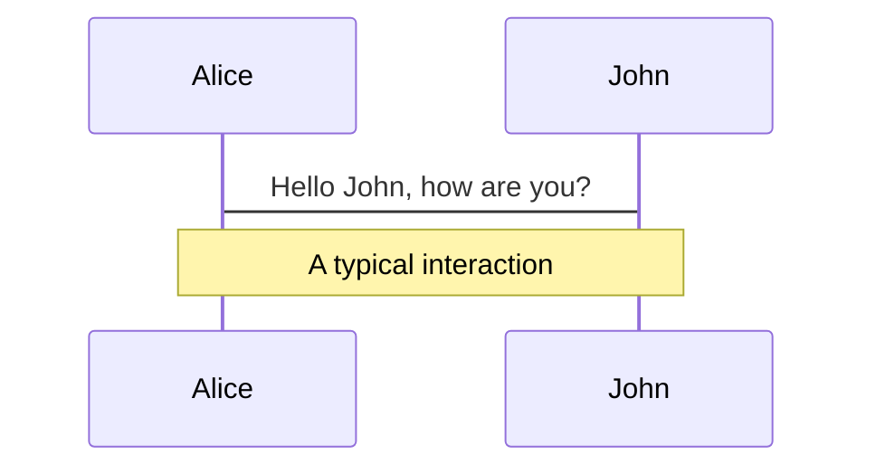
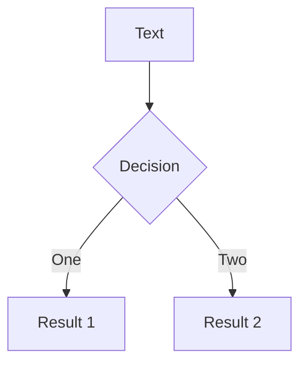
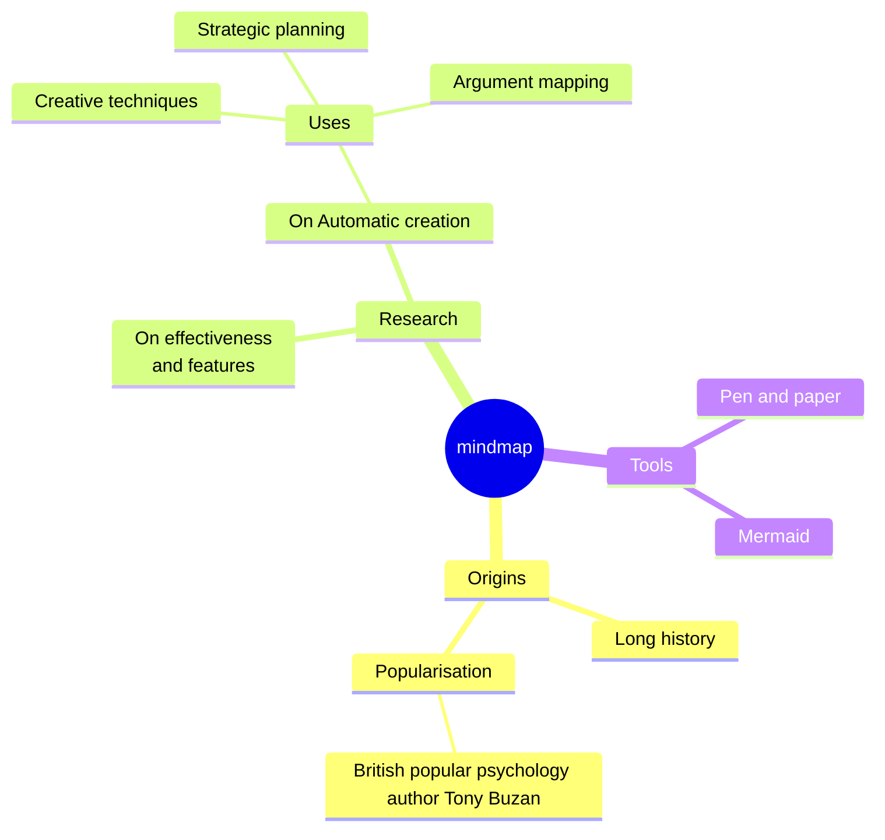
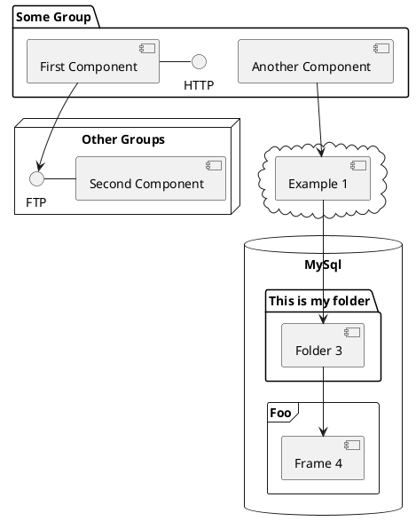

---
# You can also start simply with 'default'
theme: default
# random image from a curated Unsplash collection by Anthony
# like them? see https://unsplash.com/collections/94734566/slidev
# background: https://cover.sli.dev
# some information about your slides (markdown enabled)
title: Slidev
info: |
  ## Slidev Starter Template
  Presentation slides for developers.
# apply unocss classes to the current slide
class: text-center
# https://sli.dev/features/drawing
drawings:
  persist: true
# slide transition: https://sli.dev/guide/animations.html#slide-transitions
transition: slide-left
# enable MDC Syntax: https://sli.dev/features/mdc
mdc: true
---

# Welcome to Slidev !

專為開發者打造的簡報工具<br/>
( presentation by Laura )

<div class="abs-br m-6 text-xl">
  <a href="https://github.com/llaurrrraa/introduce_slidev" target="_blank" class="slidev-icon-btn">
    <carbon:logo-github />
  </a>
</div>

<style>

h1 {
  font-weight: bold;
  letter-spacing: 1.05px;
  font-size: 2.25rem !important;
  margin-bottom: 0.5rem;
}
.dark h1 {
  color: #fff !important;
}
.light h1 {
  color:rgb(0, 0, 0);
}

.slidev-layout h1 + p {
  opacity: 0.75;
}
.slidev-layout a.slidev-icon-btn:hover {
  color: #000;
}
.slidev-layout a:hover {
  padding: 0.5rem;
}
</style>

<!--
The last comment block of each slide will be treated as slide notes. It will be visible and editable in Presenter Mode along with the slide. [Read more in the docs](https://sli.dev/guide/syntax.html#notes)
-->

---
transition: fade-out
---

# What is Slidev?

▎　幫助開發者使用熟悉的技術，使簡報更有趣、提供極強的彈性和互動性。

- 📝 **基於 Markdown** - 先專心寫內容，也可以使用 Markdown 編排，樣式之後再調整就好！
- 🎨 **Themable** - 利用 npm 套件重複使用主題
- 👩‍💻 **Developer Friendly** - 提示程式碼、即時寫 code 
- 🎮 **Interactive** - 撰寫 Vue 元件並在簡報期間與其互動，以更有趣直觀的方式簡報
- 🎥 **Recording** - 內置錄影和攝像頭
- 📤 **Portable** - 支援匯出為 PDF、PPTX 和圖片格式，也能編譯成靜態網頁
- 🛠 **Hackable** - 作為一個基於網頁的簡報平台，因此能實現任何在網頁應用程式中的功能。例如，WebGL、API 請求、iframe 等。
<br>
<br>

Read more about [Why Slidev?](https://sli.dev/guide/why)

<!--
You can have `style` tag in markdown to override the style for the current page.
Learn more: https://sli.dev/features/slide-scope-style
-->

<style>
li {
  /* font-weight: bold; */
    font-size: 1.025rem;
  letter-spacing: 0.85px;
}
.light strong {
  color: #fff !important;
  padding: 0 0.5rem !important;
  letter-spacing: 0.5px;
  background-color: #000;
}
strong {
  color: #000 !important;
  padding: 0 0.5rem !important;
  letter-spacing: 0.5px;
  background-color: #fff;
}
</style>

<!--
Here is another comment.
-->

---
transition: slide-up
---

# 導覽列 Navigation

▎　在播放模式下，導覽列位於頁面左下角。


| Keyboard Shortcut      | Button in Navigation Bar            | Description   |
| ---------------------- | ----------------------------------- |---------------|
| <kbd>f</kbd>           | <mdi-arrow-expand /><mdi-arrow-collapse />                       | 切換為全螢幕   |
| <kbd>d</kbd>           | <svg viewBox="0 0 32 32" width="1.2em" height="1.2em" class="inline-icon-btn" style="display: inline-block;"><path fill="currentColor" d="M16 12.005a4 4 0 1 1-4 4a4.005 4.005 0 0 1 4-4m0-2a6 6 0 1 0 6 6a6 6 0 0 0-6-6M5.394 6.813L6.81 5.399l3.505 3.506L8.9 10.319zM2 15.005h5v2H2zm3.394 10.193L8.9 21.692l1.414 1.414l-3.505 3.506zM15 25.005h2v5h-2zm6.687-1.9l1.414-1.414l3.506 3.506l-1.414 1.414zm3.313-8.1h5v2h-5zm-3.313-6.101l3.506-3.506l1.414 1.414l-3.506 3.506zM15 2.005h2v5h-2z"></path></svg><svg style="display:inline-block;" viewBox="0 0 32 32" width="1.2em" height="1.2em" class="inline-icon-btn"><path fill="currentColor" d="M13.503 5.414a15.076 15.076 0 0 0 11.593 18.194a11.1 11.1 0 0 1-7.975 3.39c-.138 0-.278.005-.418 0a11.094 11.094 0 0 1-3.2-21.584M14.98 3a1 1 0 0 0-.175.016a13.096 13.096 0 0 0 1.825 25.981c.164.006.328 0 .49 0a13.07 13.07 0 0 0 10.703-5.555a1.01 1.01 0 0 0-.783-1.565A13.08 13.08 0 0 1 15.89 4.38A1.015 1.015 0 0 0 14.98 3"></path></svg> | 切換深色模式 |
| -                      |  <svg viewBox="0 0 32 32" width="1.2em" height="1.2em" class="inline-icon-btn" style="display: inline-block;"><path fill="currentColor" d="M16 8a5 5 0 1 0 5 5a5 5 0 0 0-5-5m0 8a3 3 0 1 1 3-3a3.003 3.003 0 0 1-3 3"></path><path fill="currentColor" d="M16 2a14 14 0 1 0 14 14A14.016 14.016 0 0 0 16 2m-6 24.377V25a3.003 3.003 0 0 1 3-3h6a3.003 3.003 0 0 1 3 3v1.377a11.9 11.9 0 0 1-12 0m13.993-1.451A5 5 0 0 0 19 20h-6a5 5 0 0 0-4.992 4.926a12 12 0 1 1 15.985 0"></path></svg><svg viewBox="0 0 32 32" width="1.2em" height="1.2em" class="inline-icon-btn" style="display: inline-block;"><path fill="currentColor" d="M21 26H4a2 2 0 0 1-2-2V8a2 2 0 0 1 2-2h17a2 2 0 0 1 2 2v4.06l5.42-3.87A1 1 0 0 1 30 9v14a1 1 0 0 1-1.58.81L23 19.94V24a2 2 0 0 1-2 2M4 8v16h17v-6a1 1 0 0 1 1.58-.81L28 21.06V10.94l-5.42 3.87A1 1 0 0 1 21 14V8Z"></path></svg>         | 切換攝影機鏡頭、開始錄影 |
| -                      | <svg viewBox="0 0 32 32" width="1.2em" height="1.2em" class="inline-icon-btn" style="display: inline-block;"><path fill="currentColor" d="M29.415 19L27.7 17.285A3 3 0 0 0 28 16a3 3 0 1 0-3 3a3 3 0 0 0 1.286-.3L28 20.414V28h-6v-3a7.01 7.01 0 0 0-7-7H9a7.01 7.01 0 0 0-7 7v5h28v-9.586A2 2 0 0 0 29.415 19M4 25a5.006 5.006 0 0 1 5-5h6a5.006 5.006 0 0 1 5 5v3H4Z"></path><path fill="currentColor" d="M12 4a5 5 0 1 1-5 5a5 5 0 0 1 5-5m0-2a7 7 0 1 0 7 7a7 7 0 0 0-7-7"></path></svg> |  進入簡報模式  |
| -                      | <svg viewBox="0 0 32 32" width="1.2em" height="1.2em" class="inline-icon-btn" style="display: inline-block;"><path d="M29.537 13.76l-3.297-3.297a1.586 1.586 0 0 0-2.24 0L10 24.467V30h5.533l14.004-14a1.586 1.586 0 0 0 0-2.24zM14.704 28H12v-2.704l9.44-9.441l2.705 2.704zM25.56 17.145l-2.704-2.704l2.267-2.267l2.704 2.704z" fill="currentColor"></path><path d="M11 17h2v-7h3V8H8v2h3v7z" fill="currentColor"></path><path d="M8 20H4V4h16v4h2V4a2 2 0 0 0-2-2H4a2 2 0 0 0-2 2v16a2 2 0 0 0 2 2h4z" fill="currentColor"></path></svg> |  進入編輯器  |


<style>
.slidev-icon, svg {
  border: 0.75px solid rgba(0, 0, 0, 0.25);
  border-radius: 2px;
  padding: 0.5px;
  margin: 0 2px;
}
.dark .slidev-icon, .dark svg {
  border: 0.85px solid rgba(255,255,255, 0.25);
}
</style>

---
layout: two-cols
layoutClass: gap-16
---

# 目錄 Table of contents

▎　使用 Toc 元件來自動生成目錄

```html
<Toc minDepth="1" maxDepth="1" />
```

標題會根據投影片內容自動產生，或者你也可以在前言裡用 `title` 和 `level` 自行設定。

Read more about [Toc](https://sli.dev/builtin/components#toc)

::right::

<Toc text-sm minDepth="1" maxDepth="2" />

<style>
a div p {
  font-size: 1.25rem !important;
}
</style>

---

# 程式碼 Code

▎　顯示片段程式碼並 Highlight 重點，也可以提示型別

```ts {all|5|7|7-8|10|all} twoslash
// TwoSlash enables TypeScript hover information
// and errors in markdown code blocks
// More at https://shiki.style/packages/twoslash

import { computed, ref } from 'vue'

const count = ref(0)
const doubled = computed(() => count.value * 2)

doubled.value = 2
```

<arrow v-click="[4, 5]" x1="350" y1="310" x2="195" y2="334" color="#953" width="2" arrowSize="1" />

<!-- This allow you to embed external code blocks -->
<<< @/snippets/external.ts#snippet

<!-- Footer -->

[Learn more](https://sli.dev/features/line-highlighting)

<!-- Inline style -->
<style>
.footnotes-sep {
  @apply mt-5 opacity-10;
}
.footnotes {
  @apply text-sm opacity-75;
}
.footnote-backref {
  display: none;
}
</style>

<!--
Notes can also sync with clicks

[click] This will be highlighted after the first click

[click] Highlighted with `count = ref(0)`

[click:3] Last click (skip two clicks)
-->

---
level: 2
---

# Shiki Magic Move

Powered by [shiki-magic-move](https://shiki-magic-move.netlify.app/), Slidev supports animations across multiple code snippets.

Add multiple code blocks and wrap them with <code>````md magic-move</code> (four backticks) to enable the magic move. For example:

````md magic-move {lines: true}
```ts {*|2|*}
// step 1
const author = reactive({
  name: 'John Doe',
  books: [
    'Vue 2 - Advanced Guide',
    'Vue 3 - Basic Guide',
    'Vue 4 - The Mystery'
  ]
})
```

```ts {*|1-2|3-4|3-4,8}
// step 2
export default {
  data() {
    return {
      author: {
        name: 'John Doe',
        books: [
          'Vue 2 - Advanced Guide',
          'Vue 3 - Basic Guide',
          'Vue 4 - The Mystery'
        ]
      }
    }
  }
}
```

```ts
// step 3
export default {
  data: () => ({
    author: {
      name: 'John Doe',
      books: [
        'Vue 2 - Advanced Guide',
        'Vue 3 - Basic Guide',
        'Vue 4 - The Mystery'
      ]
    }
  })
}
```

Non-code blocks are ignored.

```vue
<!-- step 4 -->
<script setup>
const author = {
  name: 'John Doe',
  books: [
    'Vue 2 - Advanced Guide',
    'Vue 3 - Basic Guide',
    'Vue 4 - The Mystery'
  ]
}
</script>
```
````

---

# Components

<div grid="~ cols-2 gap-4">
  <div>

  You can use Vue components directly inside your slides.

  We have provided a few built-in components like `<Tweet/>` and `<Youtube/>` that you can use directly. And adding your custom components is also super easy.

  ```html
  <Counter :count="10" />
  ```

  <!-- ./components/Counter.vue -->
  <Counter :count="10" m="t-4" />

  Check out [the guides](https://sli.dev/builtin/components.html) for more.

  </div>
  <div>

  ```html
  <Tweet id="1390115482657726468" />
  ```

  <Tweet id="1390115482657726468" scale="0.65" />

  </div>
</div>

<!--
Presenter note with **bold**, *italic*, and ~~striked~~ text.

Also, HTML elements are valid:
<div class="flex w-full">
  <span style="flex-grow: 1;">Left content</span>
  <span>Right content</span>
</div>
-->

---
class: px-20
---

# Themes

Slidev comes with powerful theming support. Themes can provide styles, layouts, components, or even configurations for tools. Switching between themes by just **one edit** in your frontmatter:

<div grid="~ cols-2 gap-2" m="t-2">

```yaml
---
theme: default
---
```

```yaml
---
theme: seriph
---
```


</div>

Read more about [How to use a theme](https://sli.dev/guide/theme-addon#use-theme) and
check out the [Awesome Themes Gallery](https://sli.dev/resources/theme-gallery).

---

# Clicks Animations

You can add `v-click` to elements to add a click animation.

<div v-click>

This shows up when you click the slide:

```html
<div v-click>This shows up when you click the slide.</div>
```

</div>

<br>

<v-click>

The <span v-mark.red="3"><code>v-mark</code> directive</span>
also allows you to add
<span v-mark.circle.orange="4">inline marks</span>
, powered by [Rough Notation](https://roughnotation.com/):

```html
<span v-mark.underline.orange>inline markers</span>
```

</v-click>

<div mt-20 v-click>

[Learn more](https://sli.dev/guide/animations#click-animation)

</div>

---

# Motions

Motion animations are powered by [@vueuse/motion](https://motion.vueuse.org/), triggered by `v-motion` directive.

```html
<div
  v-motion
  :initial="{ x: -80 }"
  :enter="{ x: 0 }"
  :click-3="{ x: 80 }"
  :leave="{ x: 1000 }"
>
  Slidev
</div>
```

<div class="w-60 relative">
  <div class="relative w-40 h-40">
    
    
    
  </div>

  <div
    class="text-5xl absolute top-14 left-40 text-[#2B90B6] -z-1"
    v-motion
    :initial="{ x: -80, opacity: 0}"
    :enter="{ x: 0, opacity: 1, transition: { delay: 2000, duration: 1000 } }">
    Slidev
  </div>
</div>

<!-- vue script setup scripts can be directly used in markdown, and will only affects current page -->
<script setup lang="ts">
const final = {
  x: 0,
  y: 0,
  rotate: 0,
  scale: 1,
  transition: {
    type: 'spring',
    damping: 10,
    stiffness: 20,
    mass: 2
  }
}
</script>

<div
  v-motion
  :initial="{ x:35, y: 30, opacity: 0}"
  :enter="{ y: 0, opacity: 1, transition: { delay: 3500 } }">

[Learn more](https://sli.dev/guide/animations.html#motion)

</div>

---

# LaTeX

LaTeX is supported out-of-box. Powered by [KaTeX](https://katex.org/).

<div h-3 />

Inline $\sqrt{3x-1}+(1+x)^2$

Block
$$ {1|3|all}
\begin{aligned}
\nabla \cdot \vec{E} &= \frac{\rho}{\varepsilon_0} \\
\nabla \cdot \vec{B} &= 0 \\
\nabla \times \vec{E} &= -\frac{\partial\vec{B}}{\partial t} \\
\nabla \times \vec{B} &= \mu_0\vec{J} + \mu_0\varepsilon_0\frac{\partial\vec{E}}{\partial t}
\end{aligned}
$$

[Learn more](https://sli.dev/features/latex)

---

# Diagrams

You can create diagrams / graphs from textual descriptions, directly in your Markdown.

<div class="grid grid-cols-4 gap-5 pt-4 -mb-6">

<!-- alt: 無法顯示圖表時提供描述  -->








</div>

Learn more: [Mermaid Diagrams](https://sli.dev/features/mermaid) and [PlantUML Diagrams](https://sli.dev/features/plantuml)

---
foo: bar
dragPos:
  square: 691,32,167,_,-16
---

# Draggable Elements

Double-click on the draggable elements to edit their positions.

<br>

###### Directive Usage

```md

```

<br>

###### Component Usage

```md
<v-drag text-3xl>
  <div class="i-carbon:arrow-up" />
  Use the `v-drag` component to have a draggable container!
</v-drag>
```

<v-drag pos="663,206,261,_,-15">
  <div text-center text-3xl border border-main rounded>
    Double-click me!
  </div>
</v-drag>


###### Draggable Arrow

```md
<v-drag-arrow two-way />
```

<v-drag-arrow pos="67,452,253,46" two-way op70 />

---
src: ./pages/imported-slides.md
hide: false
---

---

# Monaco Editor

Slidev provides built-in Monaco Editor support.

Add `{monaco}` to the code block to turn it into an editor:

```ts {monaco}
import { ref } from 'vue'
import { emptyArray } from './external'

const arr = ref(emptyArray(10))
```

Use `{monaco-run}` to create an editor that can execute the code directly in the slide:

```ts {monaco-run}
import { version } from 'vue'
import { emptyArray, sayHello } from './external'

sayHello()
console.log(`vue ${version}`)
console.log(emptyArray<number>(10).reduce(fib => [...fib, fib.at(-1)! + fib.at(-2)!], [1, 1]))
```

---
layout: center
class: text-center
---

# Learn More

[Documentation](https://sli.dev) · [GitHub](https://github.com/slidevjs/slidev) · [Showcases](https://sli.dev/resources/showcases)

<PoweredBySlidev mt-10 />
